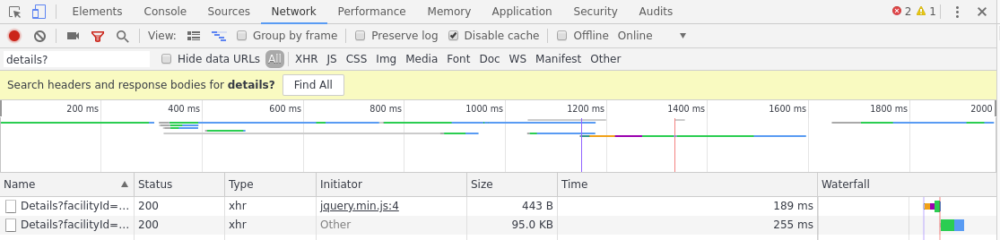
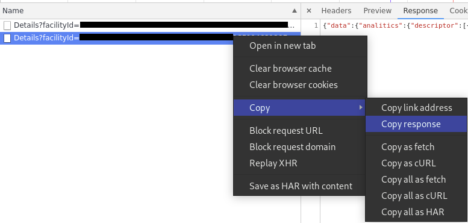

# wellness2tcx-cljs

[A Website](https://alsterman.github.io/wellness2tcx-cljs/) to convert MyWellness® json training data to Training Center XML.

The resulting tcx file can then be uploaded to other sites such as [stava.com](strava.com).

## Usage

### Getting the raw data from [mywellness.com](mywellness.com)
1. Open up Google Chrome.
2. Log in to [mywellness.com](mywellness.com) and navigate to the workout you want to convert.
3. Open the chrome developer tools and navigate to the network tab.
4. Refresh the page
5. Filter the requests by `Details?` 

6. Right click the last response and `Copy -> Copy respose`

7. The raw data is now on the clipboard.

### Converting the data
1. Go to [https://alsterman.github.io/wellness2tcx-cljs/](https://alsterman.github.io/wellness2tcx-cljs/)
2. Paste the raw data into the field.
3. Enter the time of your exercise.
4. A resulting file will be downloaded to your computer. It can be uploaded to another site such as Strava.

## License

Copyright © 2019 Marcus Alsterman

## Development Setup

To get an interactive development environment run:

    lein figwheel

and open your browser at [localhost:3449](http://localhost:3449/).
This will auto compile and send all changes to the browser without the
need to reload. After the compilation process is complete, you will
get a Browser Connected REPL. An easy way to try it is:

    (js/alert "Am I connected?")

and you should see an alert in the browser window.

To clean all compiled files:

    lein clean

To create a production build run:

    lein do clean, cljsbuild once min

And open your browser in `resources/public/index.html`. You will not
get live reloading, nor a REPL. 
